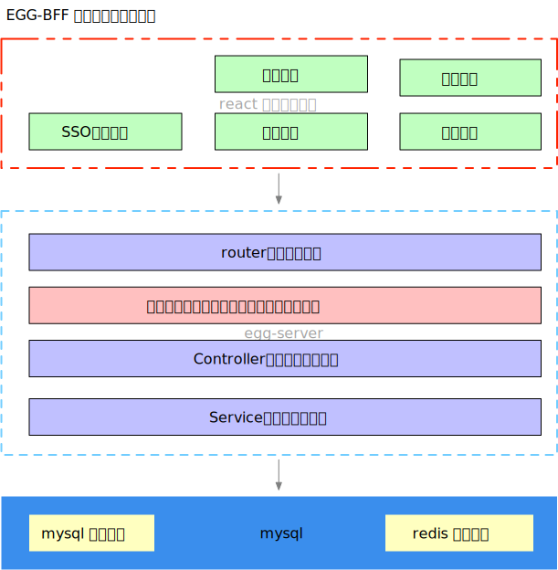
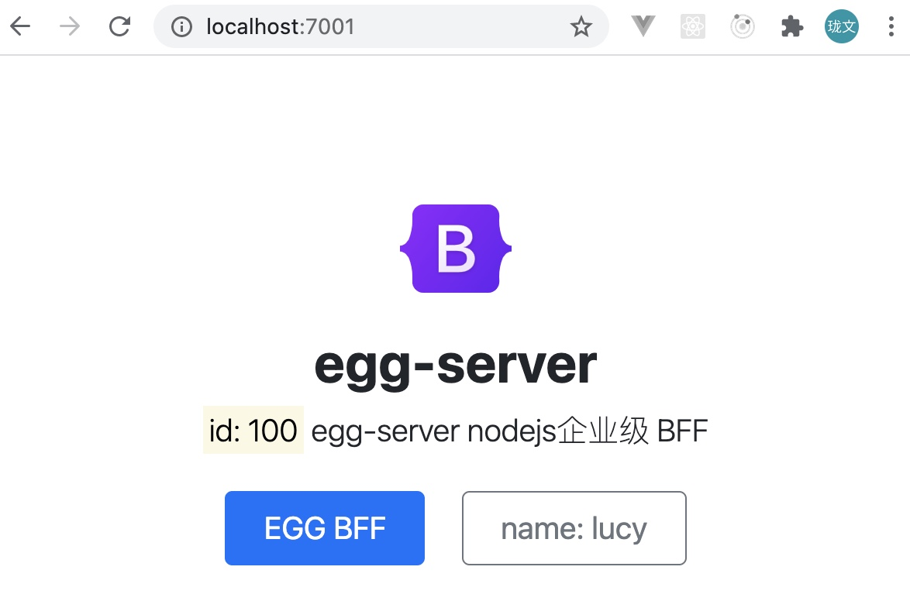

# egg-server

EGG-BFF架构图




首页效果图




## 启动项目


```bash
git clone https://github.com/lulongwen/egg-server.git
```


### 本地开发

```bash
npm i
npm run dev
open http://localhost:7001/
```


### 线上发布

```bash
npm start
npm stop
```


### npm scripts

- Use `npm run lint` to check code style.代码规范检查
- Use `npm test` to run unit test. 单元测试
- Use `npm run autod` to auto detect dependencies upgrade, see [autod](https://www.npmjs.com/package/autod) for more detail.
  - 自动检测依赖更新


### 单元测试

* [egg-bin] 内置了 [mocha], [thunk-mocha], [power-assert], [istanbul] 等框架
* 让你可以专注于写单元测试，无需理会配套工具
* 断言库推荐使用 [power-assert]
* [egg 文档 - 单元测试](https://eggjs.org/zh-cn/core/unittest)

